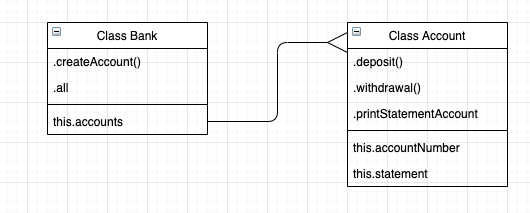

# Bank

This is a simulation of a bank project where a user that hold an account can: .deposit(), .withdrawal() and .print_statement_account.
This Bank application is written in javascript.

**- Class diagram**

**- Project plan**

| Action | Method Applied | Outcome |
| -------------- | ----------- | ------- |
| .createAccount('012345') | .account.length | 1 |
| .createAccount('012345') | .all | '012345' |
| | .printAccountStatement | 'date ll credit ll debit ll balance' |
| .deposit(01-09-2020, 100.00) | .printAccountStatement | 'date ll credit ll debit ll balance'\n'01-09-2020 ll 100.00 ll ll 100.00' |
| .withdrawal(02-09-2020, 50.00) | .printAccountStatement | 'date ll credit ll debit ll balance'\n'02-09-2020 ll ll 50.00 ll 50.00'|
| .deposit(01-09-2020, 100.00); .withdrawal(02-09-2020, 50.00) | .printAccountStatement | 'date ll credit ll debit ll balance'\n'01-09-2020 ll 100.00 ll ll 100.00'\n'02-09-2020 ll ll 50.00 ll 50.00' |
