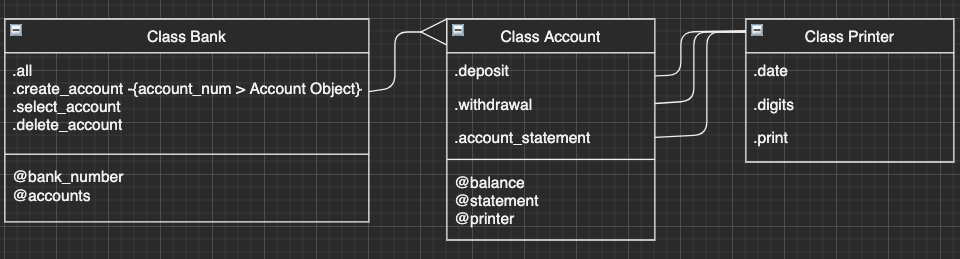

# Bank

This is a simulation of a bank project where a user that hold an account can: .deposit(), .withdrawal() and .print_statement_account.
This Bank application is written in ruby.

**- Class diagram**

